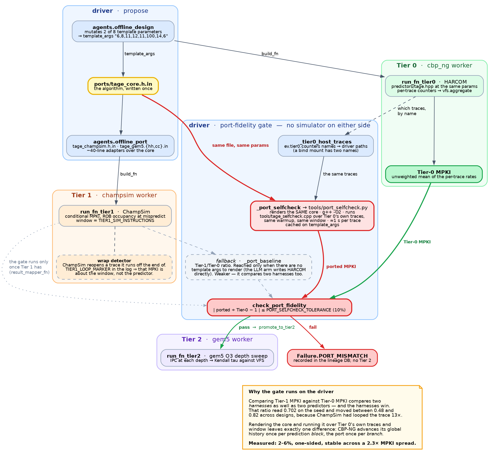

# Optimal for which pipeline?

An agent evolves HARCOM branch predictors under CBP-NG's score, and the loop
re-scores every promising design on two more complete models of the core and
reports where the three rankings disagree.

CBP-NG's Voltage-Frequency-Scaled Speedup charges a predictor for energy and
latency, not just accuracy, which makes it a far better search signal than
MPKI. What it does not let vary is the pipeline behind the predictor:
`predictor_metrics.py` pins the distance from prediction to execution at nine
stages, whatever core the throughput implies.

That nine is load-bearing. Re-scoring the organisers' own published results at
other depths — no new simulation, the depth enters the score only through CPI —
moves the ranking:

| VFS, distance to execute | 3 | 9 (shipped) | 16 | 30 |
|---|---|---|---|---|
| gshareN *(single-level)*  | 1.017 | **0.918** | 0.781 | 0.579 |
| bimodalN *(single-level)* | 1.010 | 0.894 | 0.736 | 0.522 |
| tage *(two-level)*        | 0.954 | 0.873 | **0.784** | **0.640** |
| gshare *(two-level)*      | 0.950 | 0.843 | 0.732 | 0.569 |
| bimodal *(two-level)*     | 0.940 | 0.779 | 0.634 | 0.452 |
| Kendall τ vs shipped      | 1.00 | — | 0.60 | 0.40 |

At nine stages VFS ranks TAGE *third*. From sixteen on it ranks TAGE first.
**A predictor that is VFS-optimal at nine stages is not optimal at sixteen — so
which part of the front can a search trust?**

The invariant, borrowed from [`../reveng`](../reveng): **the agent proposes, the
framework rules.** `harcom_lint.py`, `vfs.py`, `archive.py` and the promotion
gates in `evaluator.py` never call an LLM.

---

## Architecture

### The generation loop

```
                    ┌──────────────────────────────────────────────┐
                    │  MAP-Elites archive   (EPI × P1 × P2)        │
                    │  6 energy bands × 4 P1 × 6 P2 = 144 cells,   │
                    │  one elite each. Binned on COST, not score.  │
                    └───────┬──────────────────────────▲───────────┘
     parent, uniform over   │                          │  archive.add
     occupied cells         ▼                          │  (sequential,
                    ┌───────────────┐                  │   proposal order)
                    │ 1. PROPOSE    │  sequential, so the seed fixes the run
                    │               │
                    │  arm=offline  →  RNG perturbs exactly 2 of 8 params
                    │  arm=main     →  LLM writes HARCOM source
                    └───────┬───────┘
                            │  proposal = {source, template_args, rationale}
                            ▼
                    ┌───────────────┐
                    │ 2. LINT GATE  │  harcom_lint.py
                    └───┬───────┬───┘
             illegal    │       │  reaching around the cost model
             HARCOM     │       └──────────▶ WITHDRAWN (no repair round)
                        ▼
                   repair (arm=main only) ──┐
                        │                   │
                        ▼                   │
                    ┌───────────────┐       │
                    │ 3. BUILD+RUN  │◀──────┘   concurrent across variants
                    │   the cascade │
                    └───────┬───────┘
                            │  metrics = {vfs, epi, mpki, p1, p2, depth scores}
                            ▼
                    ┌───────────────┐
                    │ 4. MAP        │  result_mapper_fn → cell, or failure profile
                    └───────┬───────┘
                            │
                            └──────────── feedback ────▶ next generation's prompt
```

A generation runs in three phases — **propose** (sequential), **build and
score** (concurrent), **archive** (sequential, in proposal order). The middle
phase is safe to overlap because `_evaluate_core` never reaches `archive.add`.
Keeping archiving on the main thread in proposal order means which cells fill
does not depend on which thread finished first, so the seed reproduces the run.
The cost: a generation's variants are all proposed from the archive as it stood
at the start of it — ordinary batched MAP-Elites.

### The three-tier cascade

```
  every variant          Pareto front            elites
        │                     │                     │
        ▼                     ▼                     ▼
 ┌─────────────┐      ┌─────────────┐       ┌─────────────┐
 │  TIER 0     │      │  TIER 1     │       │  TIER 2     │
 │  CBP-NG     │─────▶│  ChampSim   │──────▶│  gem5       │
 │             │ gate │             │ gate  │             │
 │ VFS @ d=9   │      │ port        │       │ depth sweep │
 │ 126 traces  │      │ fidelity    │       │ 6,9,16,25   │
 │ pool cbp_ng │      │ pool champsim│     │ pool gem5   │
 └─────────────┘      └─────────────┘       └─────────────┘
   the fitness          same branches,        different workload:
   the search sees      different core        gem5 runs binaries,
                        model                 so this corroborates
                                              rather than repeats
```

| tier | scores | promotion gate | why it exists |
|---|---|---|---|
| 0 | VFS at the shipped depth | none — every variant | the fitness signal, and the only one the archive bins on |
| 1 | conditional MPKI on the same branch stream | `PORT_SELFCHECK_TOLERANCE` (10%) against the design's own self-check | Tiers 0 and 1 share a trace, so a gap is the *translation*, not the cost model |
| 2 | IPC at `GEM5_DEPTHS` (default 6, 9, 16, 25) | `TIER2_MAX_PROMOTED` elites (default 2) | the pipeline depth CBP-NG holds fixed — the loop's whole question |

Tier 1 compares a design against `tools/port_selfcheck.py`, **not** against a
calibrated Tier-1/Tier-0 ratio. A ratio between two simulators measures the two
*harnesses* as well as the two predictors, and here the harnesses dominated. See
[engineering notes](docs/engineering-notes.md#making-the-three-tiers-comparable).



*Source: [`docs/port_fidelity.dot`](docs/port_fidelity.dot) — regenerate with
`dot -Tpng -Gdpi=140 docs/port_fidelity.dot -o docs/port_fidelity.png`.*

### One algorithm, three simulators

```
        ports/tage_core.h.in        ← the algorithm lives here, once
        (table geometry, geometric history, folded hash,
         tag construction, provider/alt selection, meta
         counter, allocation, u-bit reset)
                 │
     ┌───────────┼───────────┐
     ▼           ▼           ▼
  cbp adapter  champsim   gem5 adapter    ← ~40 lines each
               adapter
```

Writing TAGE three times would make every cross-tier disagreement ambiguous
between "the cost models differ" and "the ports differ". The one thing the
adapters cannot reproduce: CBP-NG predicts a whole cache line per cycle and
advances global history once per *prediction block*, while ChampSim and gem5 ask
per branch. Identical predictors fed histories that advance at different rates
compute different indices, so the ports do not reproduce Tier-0 MPKI exactly —
which is what the 10% tolerance is sized for.

### The arms

The arm decides **who proposes**. Everything downstream is identical: same seed
TAGE, same template, same bounds, same grid, same parent selection, same traces.

| arm | proposes | writes source | answers |
|---|---|---|---|
| `--arm offline` | RNG perturbs exactly 2 of 8 params | no (renders template) | does the cascade work? |
| `--arm main` | LLM writes HARCOM | yes | can a model invent an algorithm? |

`--tune-bounds` is orthogonal to both: an agent moves the walls in
`agents._TAGE_PARAMS` before each generation and **never proposes a design**.
Composed with `--arm offline` the designs stay deterministic, so any change in
the trajectory is the bounds and nothing else.

```
  --tune-bounds ──▶ agents._TAGE_PARAMS ──▶ bounds the proposer must obey
        ▲                    │
        │                    └──▶ validate_bounds  ← the load-bearing check
        │
   archive summary + bound history + --occupancy-db
```

`validate_bounds` is not a formality. `ports/tage_core.h.in` computes
`TAGW - LOGLINEINST` and `LOGB - LOGLINEINST` as `uint64_t`; a bound that lets
`LOGLB-2` reach `TAGW` or `LOGB` wraps the subtraction, makes the tag mask `~0`,
and produces a predictor that **builds, runs and scores with every tag compare
passing**. A design that appears to work while its tags do nothing is worse than
one that fails to compile.

`--occupancy-db` folds an earlier sweep's *evaluated* designs into the prompt.
The archive holds only elites — one per occupied cell — which cannot distinguish
a range that was explored and scored badly from one nothing ever visited. The
agent conflates the two without it; the measurement is in the
[engineering notes](docs/engineering-notes.md#what-the-loop-has-already-caught).

### Trace split

168 official traces, one seeded shuffle, disjoint:

```
  ┌──────────────── 126 inner ────────────────┐  ┌──── 42 held out ────┐
   feedback, fitness, archive placement          --score-held-out only
```

A design that wins on the traces its own feedback came from has not been shown
to generalise. `--score-held-out` rebuilds each elite from its own recorded
source and template args, runs it on the 42, and reports Kendall tau between the
two orderings. **The scores will not match — the trace sets differ. The question
is whether the *ordering* survives.**

### Cluster

`cluster.yaml` declares four pools on one machine; `cluster_gcp.yaml` (not in
this repository — it carries site-specific GCP identifiers) adds cloud capacity
to the two trace-bound tiers.

| pool | runs | used by |
|---|---|---|
| `cbp_ng` | Tier-0 build and run | every arm |
| `champsim` | Tier-1 port and run | every arm |
| `gem5` | Tier-2 depth sweep | every arm |
| `llm` | the agents | `--arm main`, `--tune-bounds` |

---

## Layout

| file | what it is |
|---|---|
| `bp_evolve_loop.py` | the driver: phases, CLI, arms, `--score-held-out` |
| `vfs.py` | CBP-NG's score with pipeline depth as a parameter, plus the self-test against the published results |
| `archive.py` | the MAP-Elites archive and the Pareto front |
| `evaluator.py` | `build_fn` / `run_fn` / `result_mapper_fn`, the promotion gates, and the port-fidelity check |
| `harcom_lint.py` | the lint gate: illegal HARCOM (repairable) vs. reaching around the cost model (withdrawn) |
| `agents.py` | Design / Port / Repair, the offline control that replaces them, and `tune_bounds`, the agent that moves the search-space bounds and never writes a predictor |
| `cbp_ng.py` | `CbpNgNode` — Tier-0 build and run, the primitive CHIA did not have |
| `gem5_bp.py` | installs a predictor into a gem5 checkout: source, SimObject, SConscript |
| `db.py` | the lineage DB: every variant, its depth scores, what it came from, and the bounds the search ran under |
| `ports/` | `tage_core.h.in` — the algorithm — plus one thin adapter per simulator |
| `prompts/` | five templates: `design`, `tune_bounds`, `repair`, `port_champsim`, `port_gem5` |
| `tools/` | `cbp2champsim.cpp`, `port_selfcheck.py`, and the trace converter/verifier |
| `gem5/` | the depth-sweep config script and the SE-mode workloads |
| `docs/engineering-notes.md` | measurements, traps, and what the loop has caught |

---

## Running it

### Self-test first

```bash
python examples/bp_evolve/bp_evolve_loop.py --selftest --cbp-root ~/cbp-ng
```

Three checks, each of which has silently broken at least once: the scoring
against the organisers' numbers, the lint gate against all ten shipped
predictors, and one real build-and-run of the seed. No cluster, no LLM.

### Smoke test

```bash
python examples/bp_evolve/bp_evolve_loop.py --arm offline --local \
    --generations 4 --variants-per-generation 2 --inner-traces 2 \
    --no-tier1 --cbp-root ~/cbp-ng --trace-dir <a few traces>
```

`--local` starts a single-process Ray declaring the `cbp_ng` resource. Without
it the Tier-0 tasks queue forever against an autoscaler that cannot satisfy
them, which looks like a hang rather than a misconfiguration.

### Before the first cluster run

```bash
# 1. Convert the Tier-0 traces so Tier 1 sees the same branches.
tools/convert_traces.py --in <cbp-ng traces> \
    --out ~/bp_evolve_data/champsim_traces --cbp-root ~/cbp-ng --verify

# 2. Build the SE-mode workloads for Tier 2 (static, or gem5 cannot load them).
( cd gem5/workloads && for w in bsearch sort dijkstra; do
      gcc -O2 -static -o $w $w.c; done )
cp gem5/workloads/{bsearch,sort,dijkstra} ~/bp_evolve_data/gem5_workloads/

# 3. Build the two images cluster.yaml names. See the comments at the top of it.
```

### The real sweep

```bash
export THIS_MACHINE=$(hostname -I | awk '{print $1}')
python -m chia.cli.main up examples/bp_evolve/cluster.yaml -y

RAY_ADDRESS=$THIS_MACHINE:6379 python -u bp_evolve_loop.py --arm offline \
    --cbp-root /home/ray/cbp-ng      --seed-root ~/cbp-ng \
    --trace-dir /home/ray/cbp-ng/traces \
    --host-trace-dir ~/bp_evolve_data/cbp_traces \
    --champsim-trace-dir /home/ray/champsim/traces \
    --host-champsim-trace-dir ~/bp_evolve_data/champsim_traces
```

The paired `--*-root` / `--host-*` flags are the one piece of ceremony worth
understanding. Under docker the same directory has two names, and the loop needs
both: it enumerates traces and reads the seed *here*, and builds and simulates
*there*. A single path for both fails as "no traces under ..." for a directory
that is full of traces on the machine that matters.

Start with `--no-tier1`: a Tier-0-only search is a complete experiment and needs
only the `cbp_ng` pool.

### The other modes

```bash
# agent moves the search-space bounds; never proposes a design
python bp_evolve_loop.py --arm offline --tune-bounds \
    --occupancy-db <an earlier sweep's bp_evolve.db> ...

# the 42 traces no feedback came from
python bp_evolve_loop.py --score-held-out \
    --archive <archive.json> --inner-traces 126 ...
```

`--score-held-out` prints each elite as it lands rather than gathering them: it
is a multi-hour pass, and an interrupted run that gathers leaves nothing behind.

Running it on GCP, throughput and cost figures, and the reasoning behind the
gates are in [`docs/engineering-notes.md`](docs/engineering-notes.md).
